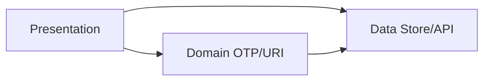

# MustAuth Flutter (`flutter_auth_qrcode_2fa`)

Flutter 移植版 **MustAuth**（對照 Android NOSMS / andOTP 衍生），提供本機 TOTP / HOTP / Steam Guard 驗證碼管理、QR 掃描與相簿辨識、分組、批次分享、加密儲存與備份還原。

## 功能特色（目前實作狀態）

| 類別 | 功能 |
|------|------|
| **OTP** | TOTP 自動刷新、HOTP/Steam 支援、一鍵複製、置頂排序 |
| **新增帳戶** | 手動編輯、相機 QR（`mobile_scanner`）、相簿 QR、Deep Link（`otpauth` / `mustauth`） |
| **分組** | 最多 10 組、主列表篩選、釘選置頂、拖曳排序、匯入時自動連結分組 |
| **分享** | 多選匯出批次 QR（每張最多 8 筆）、分享歷史、匯出前安全驗證 |
| **儲存** | AES-GCM `secrets.dat`、`grouplistjson`、`shareaccountlistjson` |
| **備份** | 明文 `otp_accounts.json`、PBKDF2 加密 `.json.aes` |
| **安全** | 指紋/臉部（`local_auth`）、背景 5 分鐘鎖、九宮格手勢 |
| **API** | `POST /version` 檢查更新、動態 domain |

尚未實作：Panic Button、背景模糊、WebView 說明頁、主列表搜尋、剪貼簿 URI 偵測等（詳見 [docs/SDD.md §3](docs/SDD.md#3-已實作功能清單)）。

## 規格與設計文件

| 文件 | 說明 |
|------|------|
| **[docs/SDD.md](docs/SDD.md)** | **軟體設計文件**（架構、類別、Mermaid 圖表） |
| [docs/requirements.md](docs/requirements.md) | 功能需求（FR-xx） |
| [docs/design.md](docs/design.md) | Android 對照、URI、加密、Deep Link |
| [docs/tasks.md](docs/tasks.md) | 分階段實作任務 |
| [docs/spec.json](docs/spec.json) | 規格元資料（language: zh-TW） |

## 建置與執行

```bash
flutter pub get
flutter run \
  --dart-define=API_BASE_URL=https://maapi-dev.azuredigitaltech.com.tw:18443/api/ \
  --dart-define=WEB_BASE_URL=https://mustauth.com/
```

| 參數 | 用途 |
|------|------|
| `API_BASE_URL` | 版本檢查 API 根路徑（`VersionApiClient`，對應 Android `BuildConfig`） |
| `WEB_BASE_URL` | 說明/隱私 WebView 基底（預留，尚未實作 UI） |

## 測試

```bash
flutter test
dart analyze lib
```

現有單元測試涵蓋：`OtpGenerator`、`OtpUriParser`、`BatchQrCodec`、`OtpAccount` JSON、`GroupRepository`、`EncryptedAccountStore`、`import_group_linker`。

## 專案結構

```
lib/
├── domain/          # OtpAccount, OtpGenerator, OtpUriParser, BatchQrCodec, GroupModel
├── data/            # EncryptedAccountStore, repositories, BackupService, QrImageDecoder
└── presentation/    # Riverpod, screens, DeepLinkHandler, SecurityService
test/                # domain / data / presentation 單元測試
docs/                # SDD, requirements, design, tasks
android/ ios/        # 原生 QR MethodChannel、Deep Link manifest
```

## 架構概覽



完整 **類別圖、循序圖、畫面流程圖** 見 [docs/SDD.md](docs/SDD.md#12-類別圖class-diagram)。

## 與 Android 互通性

| 項目 | 說明 |
|------|------|
| **Keystore / `secrets.dat`** | Android 以 Keystore 包裝 `otp.key`；Flutter 使用 `flutter_secure_storage`，**無法直接互換**本機資料庫。請用備份格式遷移。 |
| **明文備份** | `otp_accounts.json` — 欄位與 `Entry.toJSON()` 一致（`last_used`、`istag` 等）。 |
| **加密備份** | `otp_accounts.json.aes` — `[4B iterations BE][12B salt][AES-GCM]`；PBKDF2-HmacSHA1。 |
| **批次 QR / URI** | 支援 `mustauth://` / `otpauth://` 及 `mulitpleURL` 歷史拼字。 |
| **手勢鎖** | Android 舊版硬編碼 AES/ECB；Flutter 以 SharedPreferences 儲存，**密文不相容**。 |

## 平台注意事項

### Deep Link

- **Android**：`AndroidManifest.xml` — `intent-filter` VIEW + `otpauth` / `mustauth`（hosts: `totp`, `hotp`, `*`）
- **iOS**：`Info.plist` — `CFBundleURLTypes` 註冊相同 scheme
- **Flutter**：`app_links` + `DeepLinkHandler`

### 相簿 QR 原生辨識

| 平台 | 實作 |
|------|------|
| **Android** | ZXing `QRCodeReader`（`QrImageDecodeHandler.kt`） |
| **iOS** | Apple Vision `VNDetectBarcodesRequest`（`QrImageDecodePlugin.swift`） |
| **Flutter** | MethodChannel `com.example.flutter_auth_qrcode_2fa/qr_decode`；失敗時 fallback `mobile_scanner.analyzeImage` |
| **Web** | 不支援相簿 QR |

即時相機掃描仍使用 `mobile_scanner`（`QrScanScreen`）。

### 權限

- Android：`CAMERA`、`READ_MEDIA_IMAGES`（API≤32 另需 `READ_EXTERNAL_STORAGE`）
- iOS：`NSCameraUsageDescription`、`NSPhotoLibraryUsageDescription`
