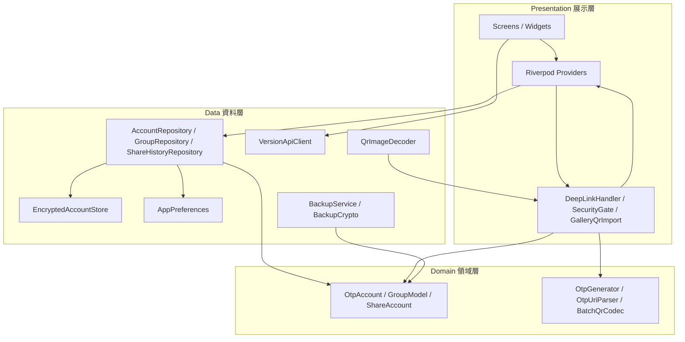
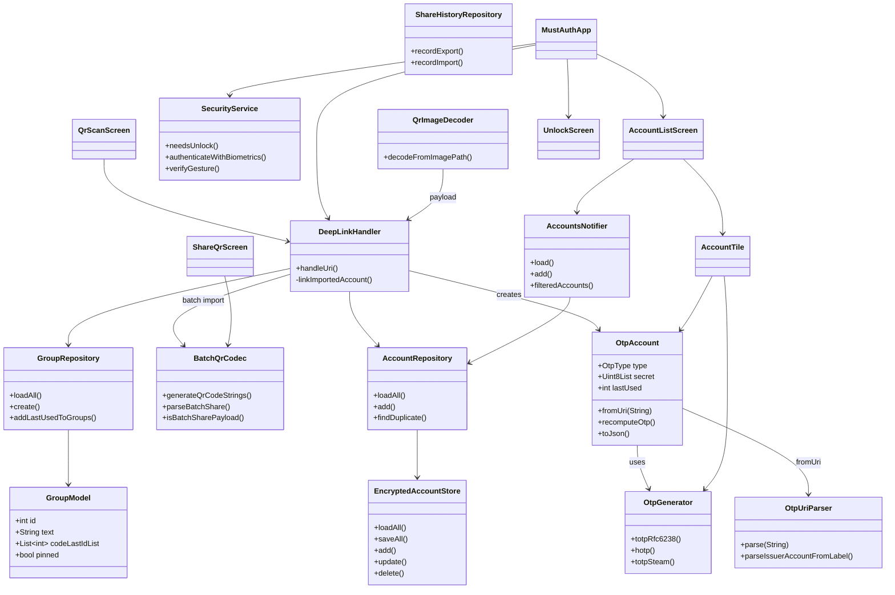
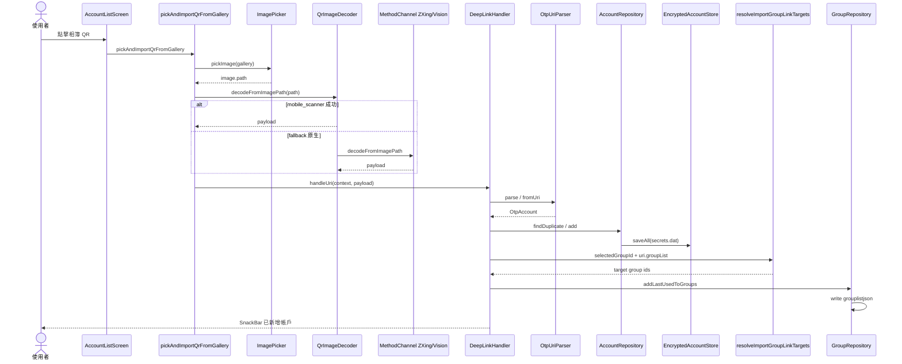
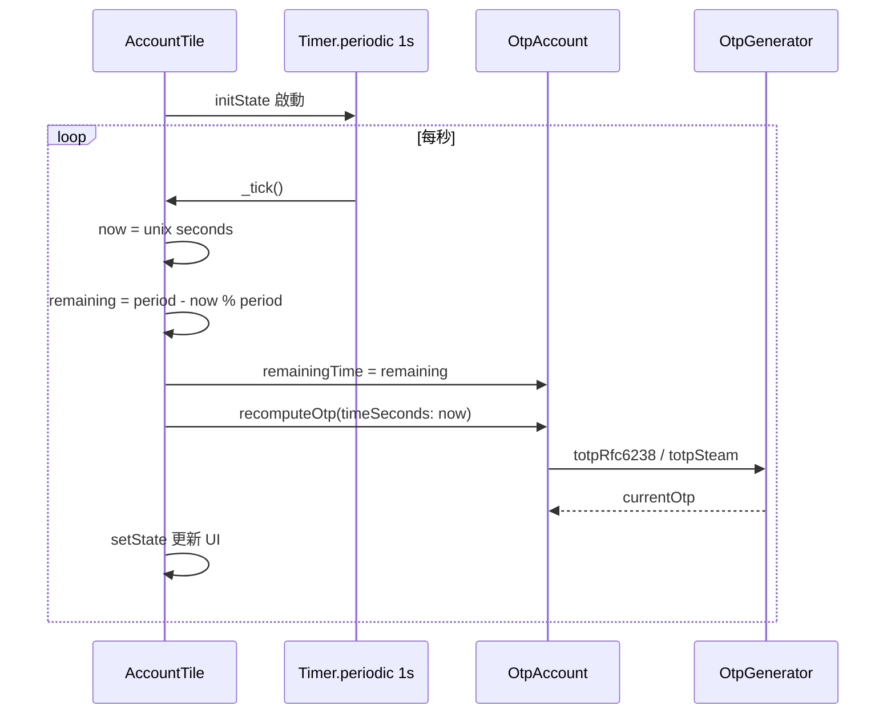
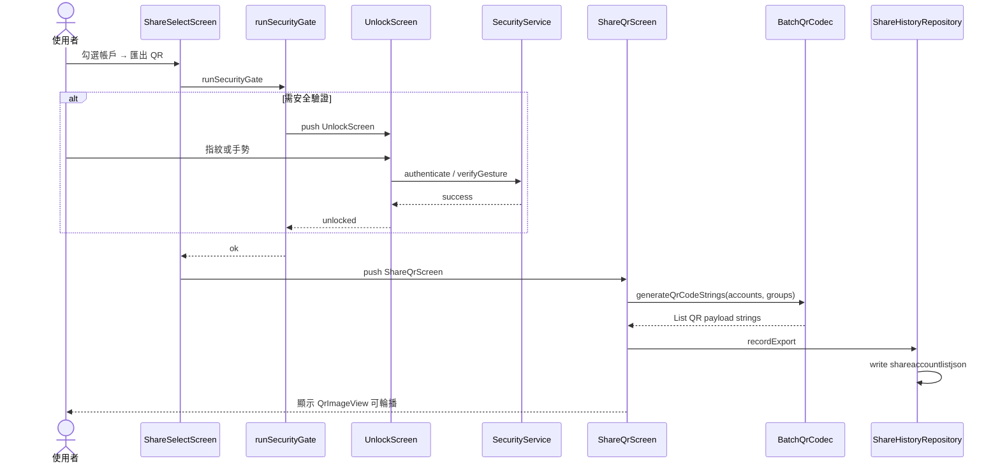
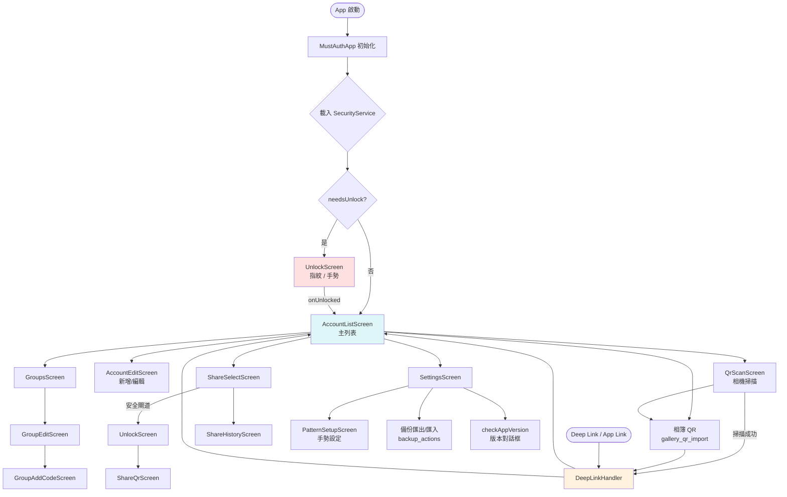

# 軟體設計文件（SDD）— MustAuth Flutter

> 語言：繁體中文（zh-TW，見 [spec.json](./spec.json)）  
> 本文件描述 **目前程式碼已實作** 之架構、類別職責與關鍵流程，並以 Mermaid 圖表呈現。詳細演算法與 Android 對照請參閱 [design.md](./design.md)。

---

## 1. 專案概述

**MustAuth Flutter**（套件名 `flutter_auth_qrcode_2fa`）為 Android 版 MustAuth / NOSMS（andOTP 衍生）之跨平台移植。核心能力：

- 本機計算 **TOTP / HOTP / Steam Guard** OTP
- 加密儲存帳戶（`secrets.dat` 格式）
- QR 掃描、相簿辨識、Deep Link（`otpauth://` / `mustauth://`）匯入
- 分組管理、批次 QR 分享、備份還原
- 生物辨識 / 手勢解鎖、背景 5 分鐘鎖定
- 版本 API 檢查與動態網域更新

**狀態管理**：Flutter Riverpod（`StateNotifier` + `FutureProvider`）  
**入口**：`lib/main.dart` → `MustAuthApp`（`lib/presentation/app.dart`）

---

## 2. 架構分層



| 層級 | 目錄 | 職責 |
|------|------|------|
| **Presentation** | `lib/presentation/` | UI 畫面、Riverpod 狀態、Deep Link / 安全閘道、相簿匯入協調 |
| **Domain** | `lib/domain/` | 純 Dart 領域模型與演算法（無 Flutter 依賴） |
| **Data** | `lib/data/` | 持久化、加密、API、原生 QR MethodChannel 封裝 |

---

## 3. 已實作功能清單

對照 [tasks.md](./tasks.md) Phase 0–7 與原 deferred 項目之 **目前實作狀態**：

### Phase 0：專案骨架

| 任務 | 狀態 | 說明 |
|------|------|------|
| T0.1 | ✅ | `lib/domain`、`lib/data`、`lib/presentation`、`test/` |
| T0.2 | ✅ | `--dart-define=API_BASE_URL`、`WEB_BASE_URL`（`VersionApiClient`） |
| T0.3 | ✅ | `app_links` + Android `AndroidManifest` / iOS `Info.plist` |

### Phase 1：核心 OTP

| 任務 | 狀態 | 說明 |
|------|------|------|
| T1.1–T1.5 | ✅ | `OtpGenerator`、`OtpUriParser`、`OtpAccount` JSON；單元測試齊備 |

### Phase 2：本機儲存

| 任務 | 狀態 | 說明 |
|------|------|------|
| T2.1–T2.4 | ✅ | `EncryptedAccountStore` AES-GCM + `flutter_secure_storage` 金鑰 |
| T2.5 | ✅ | `BackupService` / `BackupCrypto` 明文與 `.json.aes` |

### Phase 3：主流程 UI

| 任務 | 狀態 | 說明 |
|------|------|------|
| T3.1 | ✅ | 帳戶列表、TOTP 倒數、複製、置頂、依 `last_used` 排序 |
| T3.2 | ✅ | `AccountEditScreen` 手動新增/編輯 |
| T3.3 | ✅ | `QrScanScreen`（`mobile_scanner`） |
| T3.4 | ✅ | 相簿 QR（見 §9） |
| T3.5 | ✅ | `DeepLinkHandler`（`action=set` / `get`、批次 `mulitpleURL`） |
| T3.6 | ✅ | `DuplicateAccountDialog` 覆蓋邏輯 |

### Phase 4：分組

| 任務 | 狀態 | 說明 |
|------|------|------|
| T4.1–T4.3 | ✅ | `GroupRepository`、`grouplistjson`、主列表 FilterChip 篩選 |
| T4.2 | ⚠️ 部分 | 釘選已實作；**拖曳排序**尚未實作 |
| T4.4 | ✅ | 上限 10 組（`GroupRepository.maxGroups`） |

### Phase 5：分享 / 批次 QR

| 任務 | 狀態 | 說明 |
|------|------|------|
| T5.1–T5.6 | ✅ | 多選、`BatchQrCodec`、`ShareQrScreen`、歷史、`runSecurityGate` |

### Phase 6：安全

| 任務 | 狀態 | 說明 |
|------|------|------|
| T6.1 | ✅ | `local_auth` + `isSecurityValidation` |
| T6.2 | ✅ | 背景 5 分鐘鎖（`SecurityService` + 生命週期） |
| T6.3 | ✅ | 九宮格手勢（`PatternLockGrid`，最少 4 點） |
| T6.4 | ❌ | 背景模糊遮罩未實作 |
| T6.5 | ❌ | Panic Button 未實作 |
| T6.6 | ❌ | 螢幕截圖防護未實作 |

### Phase 7：API 與周邊

| 任務 | 狀態 | 說明 |
|------|------|------|
| T7.1–T7.2 | ✅ | `VersionApiClient` + `checkAppVersion` 對話框 |
| T7.3 | ❌ | WebView 說明/隱私頁未實作 |
| T7.4 | ⚠️ 部分 | 設定頁：安全、手勢、備份、版本；**主題/語系/排序** 未完整 |

### Phase 8 與其他

| 項目 | 狀態 | 說明 |
|------|------|------|
| T8.1–T8.4 | ⚠️ 部分 | Domain/Data 單元測試已有；整合/E2E 待補 |
| T8.5 | ✅ | README + 本 SDD |
| FR-01.8 搜尋 | ❌ | 主列表搜尋未實作 |
| FR-02.4 剪貼簿偵測 | ❌ | 未實作 |
| HOTP counter+1 UI | ⚠️ 部分 | 顯示計數器；一鍵遞增 UI 待補 |

---

## 4. 核心類別與職責

### 4.1 Domain

| 類別 | 檔案 | 職責 |
|------|------|------|
| `OtpAccount` | `domain/otp_account.dart` | 帳戶模型（對應 Android `Entry`）；`fromUri`、JSON、`recomputeOtp()` |
| `OtpGenerator` | `domain/otp_generator.dart` | RFC 4226/6238 + Steam 演算法 |
| `OtpUriParser` | `domain/otp_uri_parser.dart` | `otpauth`/`mustauth` URI 解析 |
| `BatchQrCodec` | `domain/batch_qr_codec.dart` | 批次 QR 匯出/匯入（`mulitpleURL`） |
| `GroupModel` | `domain/group_model.dart` | 分組模型（`codeLastIdList`） |
| `ShareAccount` | `domain/share_account.dart` | 分享歷史紀錄模型 |
| `Base32Util` | `domain/base32_util.dart` | Base32 編解碼 |
| `HashAlgorithm` / `OtpType` / `ThirdPartyAction` | `domain/*.dart` | 列舉型別 |

### 4.2 Data

| 類別 | 檔案 | 職責 |
|------|------|------|
| `EncryptedAccountStore` | `data/encrypted_account_store.dart` | AES-GCM 讀寫 `secrets.dat` |
| `AesGcmCipher` | `data/aes_gcm_cipher.dart` | GCM 加解密輔助 |
| `AccountRepository` | `data/account_repository.dart` | 帳戶 CRUD + 重複偵測 |
| `GroupRepository` | `data/group_repository.dart` | 分組 CRUD、`grouplistjson` |
| `ShareHistoryRepository` | `data/share_history_repository.dart` | `shareaccountlistjson` |
| `AppPreferences` | `data/app_preferences.dart` | SharedPreferences 鍵值 |
| `BackupService` / `BackupCrypto` | `data/backup_*.dart` | 明文/加密備份 |
| `VersionApiClient` | `data/version_api_client.dart` | `POST /version` |
| `QrImageDecoder` | `data/qr_image_decoder.dart` | 相簿 QR（MethodChannel + fallback） |

### 4.3 Presentation

| 類別 / 畫面 | 檔案 | 職責 |
|-------------|------|------|
| `MustAuthApp` | `presentation/app.dart` | 根 Widget、Deep Link、生命週期鎖定 |
| `AccountsNotifier` | `presentation/providers.dart` | 帳戶列表狀態、分組篩選 |
| `DeepLinkHandler` | `presentation/deep_link_handler.dart` | URI 匯入、複製、批次、分組連結 |
| `SecurityService` | `presentation/security_service.dart` | 生物辨識、5 分鐘鎖、手勢驗證 |
| `runSecurityGate` | `presentation/security_gate.dart` | 分享前解鎖閘道 |
| `resolveImportGroupLinkTargets` | `presentation/import_group_linker.dart` | 匯入後分組關聯邏輯 |
| `pickAndImportQrFromGallery` | `presentation/gallery_qr_import.dart` | 相簿選圖 → 解碼 → DeepLinkHandler |
| `checkAppVersion` | `presentation/version_check.dart` | 版本檢查 UI |
| `AccountListScreen` | `screens/account_list_screen.dart` | 主列表 |
| `AccountEditScreen` | `screens/account_edit_screen.dart` | 新增/編輯 |
| `QrScanScreen` | `screens/qr_scan_screen.dart` | 相機掃描 |
| `UnlockScreen` | `screens/unlock_screen.dart` | 解鎖（指紋 + 手勢） |
| `PatternSetupScreen` | `screens/pattern_setup_screen.dart` | 手勢設定 |
| `GroupsScreen` / `GroupEditScreen` / `GroupAddCodeScreen` | `screens/group_*.dart` | 分組管理 |
| `ShareSelectScreen` / `ShareQrScreen` / `ShareHistoryScreen` | `screens/share_*.dart` | 分享流程 |
| `SettingsScreen` | `screens/settings_screen.dart` | 設定與備份 |
| `AccountTile` | `widgets/account_tile.dart` | 列表項 + TOTP 每秒刷新 |

---

## 5. OTP / URI / 批次 QR 演算法摘要

> 完整規格見 [design.md §3–§5](./design.md)。

### 5.1 OTP（`OtpGenerator`）

| 類型 | 方法 | 要點 |
|------|------|------|
| TOTP | `totpRfc6238` | `timeCounter = floor(unix / period)` → HOTP |
| HOTP | `hotp` | HMAC-SHA1/256/512，動態截斷 |
| Steam | `totpSteam` | TOTP binary 對 26 字元集取模 |

預設：period=30、digits=6（Steam=5）、algorithm=SHA1。

### 5.2 URI 解析（`OtpUriParser`）

1. `trim()`；scheme 正規化為 `otpauth` / `mustauth`
2. 替換 scheme 為 `http` 以便 `Uri.parse`
3. Host → `OtpType`（`totp`/`hotp`；其他小寫 host 視為 TOTP）
4. Path → label；**僅一個 `:`** 時拆 issuer:account
5. Query 覆蓋 issuer/account；`action=set|get`；重複 `group` → `groupList`

### 5.3 批次 QR（`BatchQrCodec`）

- 主 URI：`mustauth://mulitpleshare/mulitpleshare?action=mulitpleshare&mulitpleURL=...`
- 每 QR 最多 **8** 筆 `mulitpleURL`（歷史拼字 `mulitple` 不可改）
- 單筆子 URI：含 `secret`、`algorithm`、`action=set`；account 僅一個 `:` 時匯出尾端補 `:`
- 匯入：`parseBatchShare` → 逐筆 `OtpAccount.fromUri`

---

## 6. 儲存設計

### 6.1 加密帳戶庫（`EncryptedAccountStore`）

| 項目 | 值 |
|------|-----|
| 檔案 | `{appDocuments}/secrets.dat` |
| 格式 | `[12B IV][AES-GCM ciphertext]` |
| 金鑰 | 128-bit AES，存於 `flutter_secure_storage`（鍵 `otp_aes_key`） |
| 內容 | UTF-8 JSON 陣列（`OtpAccount.toJson()`） |

### 6.2 Preferences（`AppPreferences`）

| 鍵 | 用途 |
|----|------|
| `grouplistjson` | 分組 JSON 陣列 |
| `shareaccountlistjson` | 分享/匯入歷史 |
| `isSecurityValidation` | 生物辨識 + 背景鎖開關 |
| `gesture_pwd_key` | 手勢密碼（明文比對，見 §8 互通限制） |
| `enterBackgroundTime` / `isAppTerminate` | 背景鎖定時間戳 |

### 6.3 備份（`BackupService` + `BackupCrypto`）

| 格式 | 說明 |
|------|------|
| `otp_accounts.json` | 明文 JSON 陣列 |
| `otp_accounts.json.aes` | `[4B iterations BE][12B salt][AES-GCM ciphertext]`；PBKDF2-HmacSHA1 |

設定頁提供匯出/匯入四種操作（`backup_actions.dart`）。

---

## 7. 安全機制

| 機制 | 實作 | 說明 |
|------|------|------|
| 生物辨識 | `local_auth` | 設定頁開關 `isSecurityValidation` |
| 背景 5 分鐘鎖 | `SecurityService.needsUnlock` | App 啟動或背景 ≥5 分鐘 → `UnlockScreen` |
| 手勢鎖 | `PatternLockGrid` | 最少 4 點；`PatternSetupScreen` 設定 |
| 分享前驗證 | `runSecurityGate` | 匯出 QR 前推送 `UnlockScreen` |
| App 生命週期 | `MustAuthApp` | `paused` 記錄時間；`resumed` 檢查鎖定；`detached` 設終止旗標 |

---

## 8. API 版本檢查

- 客戶端：`VersionApiClient.checkVersion` → `POST {API_BASE_URL}version`
- Query：`platform`, `version`, `mid`, `brand`, `model`, `os_version`
- 回應含 `domain[]` 時呼叫 `updateBaseUrl(domain, 18443)`
- UI：`SettingsScreen` → `checkAppVersion` → AlertDialog + 外部瀏覽器開啟 `version_info.url`
- 編譯參數：`--dart-define=API_BASE_URL=...`（預設見 `VersionApiClient`）

---

## 9. 原生 QR 相簿辨識

```
ImagePicker → QrImageDecoder.decodeFromImagePath
  1. mobile_scanner.analyzeImage（優先）
  2. MethodChannel fallback
     Android: QrImageDecodeHandler（ZXing）
     iOS: QrImageDecodePlugin（Vision VNDetectBarcodesRequest）
  → DeepLinkHandler.handleUri
```

| 項目 | 值 |
|------|-----|
| Channel | `com.example.flutter_auth_qrcode_2fa/qr_decode` |
| Method | `decodeFromImagePath` |
| 即時掃描 | `QrScanScreen` 使用 `mobile_scanner`（相機預覽） |

---

## 10. 分組與匯入連結

- **管理**：`GroupsScreen` → `GroupEditScreen` → `GroupAddCodeScreen`
- **篩選**：主列表 FilterChip + `AccountsNotifier.filteredAccounts`
- **匯入連結**（`resolveImportGroupLinkTargets`）：
  - 若主列表已選分組 → 連結至該分組 **且** URI 內 `group` 名稱相符的分組
  - 若未選分組 → 僅連結 URI `group` 名稱相符的分組
- **持久化**：`GroupRepository.addLastUsedToGroups` 寫入 `grouplistjson`

---

## 11. 互通限制

| 項目 | 限制 |
|------|------|
| **Keystore / secrets.dat** | Flutter 使用 `flutter_secure_storage`，**無法直接讀取** Android `otp.key` + RSA 包裝之 `secrets.dat` |
| **跨平台遷移** | 請使用明文 JSON 或 `.json.aes` 備份 |
| **手勢密碼** | Android 舊版 AES/ECB + 硬編碼金鑰；Flutter 以 SharedPreferences 明文儲存，**密文不相容** |
| **URI 拼字** | `mulitpleURL`、`mulitpleshare` 為歷史 typo，必須原樣保留 |
| **Web** | 相簿 QR 不支援；需 Android/iOS 實機 |

---

## 12. 類別圖（Class Diagram）



---

## 13. 循序圖（Sequence Diagrams）

### 13.1 相簿 QR 匯入 + 分組連結



### 13.2 TOTP 顯示刷新



### 13.3 批次 QR 匯出



---

## 14. App 畫面流程圖



---

## 15. 相關文件

| 文件 | 說明 |
|------|------|
| [requirements.md](./requirements.md) | 功能需求 FR-xx |
| [design.md](./design.md) | Android 對照、演算法詳規 |
| [tasks.md](./tasks.md) | 分階段實作任務 |
| [spec.json](./spec.json) | 規格元資料 |
| [../README.md](../README.md) | 建置、測試、平台備註 |
