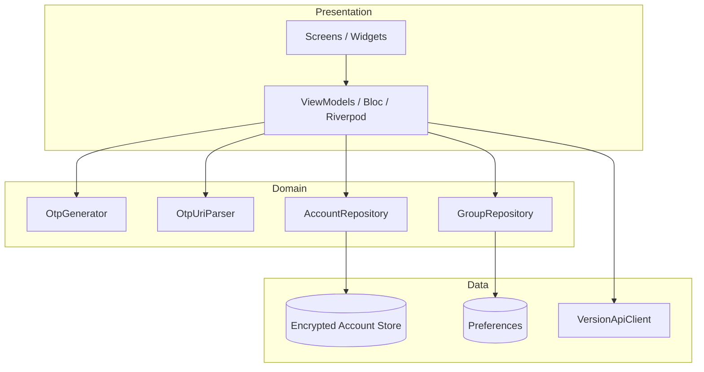

# 設計規格 — MustAuth (NOSMS) Flutter 移植

> 本文件描述 Android 參考實作之架構、資料契約與演算法，供 Flutter 專案直接對照實作。原始碼路徑前綴：`app/src/main/java/com/xtxgcsydsu/nosms/`。

---

## 1. 系統架構

### 1.1 邏輯分層（建議 Flutter 對應）



### 1.2 Android 模組對照

| Android | 職責 | Flutter 建議 |
|---------|------|----------------|
| `Entry` | 帳戶領域模型 + URI/JSON 序列化 | `OtpAccount` model + `fromUri`/`toJson` |
| `DatabaseHelper` | 加密讀寫 `secrets.dat` | `EncryptedAccountStore` |
| `TokenCalculator` | RFC 4226/6238 + Steam | `otp` 套件或自實作 + 單元測試對齊 |
| `SharedPreferencesManager` | 分組、分享紀錄、安全開關 | `shared_preferences` / `hive` |
| `Settings` | andOTP 遺留設定 | `AppSettings` |
| `JsonPlaceholderService` | 版本 API | `dio` + `VersionApi` |
| Activities | 畫面流程 | Flutter Routes |

### 1.3 畫面流程（Activity → Route）

```
Splash → Main（帳戶列表）
  ├─ EnterKey（手動新增/編輯）
  ├─ SimpleScanner / LoadingPicture（QR）
  ├─ ShareAcc → ExportAccSelect → ExportAcc（QR 顯示）
  ├─ ShareAccList → ShareAccListDetail
  ├─ Group → GroupEditCreate / GroupAddCode
  ├─ FingerPrintSetting → WholePatternSetting / PatternLockerSetting
  ├─ WholePatternChecking（分享前解鎖）
  ├─ Help / About / VersionUpdate
  └─ Deep Link / Panic（無 UI 或透明）
```

---

## 2. 領域模型

### 2.1 OtpAccount（對應 `Entry`）

```dart
enum OtpType { totp, hotp, steam }

enum HashAlgorithm { SHA1, SHA256, SHA512 }

enum ThirdPartyAction { create, copy, createFromClipboard }

class OtpAccount {
  OtpType type;
  Uint8List secret;           // Base32 解碼後
  String secretText;          // Base32 大寫字串（無 padding 或匯出時去 =）
  String issuer;
  String account;
  String label;               // URI path（未編碼形式）
  int period;                 // TOTP，預設 30
  int digits;                 // 預設 6，上限 8
  HashAlgorithm algorithm;    // 預設 SHA1
  long counter;               // HOTP
  List<String> tags;
  String thumbnailKey;        // EntryThumbnails enum name
  int lastUsed;               // 唯一 ID（JSON: last_used）
  String? currentOtp;        // UI 快取（JSON: currentOTP）
  bool hideOtp;               // ishideotp
  int remainingTime;          // TOTP 剩餘秒
  bool isTop;                 // JSON 鍵 istag
  List<String> groupList;
  ThirdPartyAction action;
}
```

### 2.2 JSON 持久化契約（`Entry.toJSON()`）

| JSON 鍵 | 型別 | 必填 | 說明 |
|---------|------|------|------|
| `secret` | string | ✓ | Base32 編碼（大寫） |
| `issuer` | string | | |
| `account` | string | | |
| `label` | string | | |
| `type` | string | ✓ | `TOTP` / `HOTP` / `STEAM` |
| `algorithm` | string | | `SHA1` / `SHA256` / `SHA512` |
| `digits` | int | | |
| `period` | int | TOTP | |
| `counter` | long | HOTP | |
| `tags` | string[] | | |
| `thumbnail` | string | | enum name |
| `last_used` | long | ✓ | 唯一 ID |
| `currentOTP` | string | | 可省略，載入後重算 |
| `ishideotp` | bool | | |
| `remainingTime` | long | | |
| `istag` | bool | | 置頂 |

**儲存檔案**：`secrets.dat` = `AES-GCM( UTF-8(JSON_ARRAY) )`，IV 為 ciphertext 前 12 bytes。

### 2.3 GroupModel

```dart
class GroupModel {
  int id;
  String text;              // 分組名稱
  List<int> codeLastIdList; // Entry.lastUsed 列表
  bool pinned;
}
```

持久化：`grouplistjson` = Gson(JSON array) 等效。

### 2.4 ShareAccount（匯入/匯出歷史）

```dart
class ShareAccount {
  String type;              // "import"
  String actionContent;     // "导入：N个验证码" / "导出：..."
  String actionDate;
  List<ShareAccountDetail> shareAccountDetail;
}

class ShareAccountDetail {
  String issuer;
  String account;
  String group;             // 空格串接的 group 名稱
}
```

鍵：`shareaccountlistjson`。

---

## 3. OTP 演算法（必須與 `TokenCalculator` 一致）

### 3.1 常數

| 常數 | 值 |
|------|-----|
| `TOTP_DEFAULT_PERIOD` | 30 |
| `TOTP_DEFAULT_DIGITS` | 6 |
| `STEAM_DEFAULT_DIGITS` | 5 |
| `DEFAULT_ALGORITHM` | SHA1 |
| Steam 字元集 | `23456789BCDFGHJKLMNPQRSTVWXYZ`（26 字元） |

### 3.2 HOTP（RFC 4226）

```
counterBytes = bigEndianInt64(counter)
hash = HMAC(algorithm, secret, counterBytes)
offset = hash[last] & 0x0F
binary = (hash[offset] & 0x7F) << 24 | ... | hash[offset+3]
code = binary % 10^digits
輸出 = 左側補零至 digits 位
```

### 3.3 TOTP（RFC 6238）

```
timeCounter = floor(unixTimeSeconds / period)
return HOTP(secret, timeCounter, ...)
```

### 3.4 Steam

```
fullToken = TOTP 內部 binary（不取 mod 10^digits）
for i in 0..digits-1:
  char = STEAMCHARS[fullToken % 26]
  fullToken /= 26
```

### 3.5 Secret 編碼

- 輸入：Base32（A-Z, 2-7），URI/手輸入轉大寫
- 函式庫：Apache Commons Base32（Android）；Flutter 可用 `base32` package
- 驗證 regex：`^[a-zA-Z2-7]{2,}$`

### 3.6 產碼入口（Entry）

| type | 方法 |
|------|------|
| TOTP | `TOTP_RFC6238(secret, period, digits, algorithm)` |
| HOTP | `HOTP(secret, counter, digits, algorithm)` |
| STEAM | `TOTP_Steam(secret, period, digits, algorithm)` |

---

## 4. URI 解析規格（`Entry(String contents)`）

### 4.1 前處理

1. `trim()`
2. scheme 小寫：`otpauth://...` / `mustauth://...`
3. 將 `otpauth` / `mustauth` 替換為 `http` 以便 URL 解析
4. 驗證 protocol 為 `http`（替換後）

### 4.2 Host → Type

| Host | OTPType |
|------|---------|
| `totp` | TOTP |
| `hotp` | HOTP |
| 其他（全小寫） | TOTP，並 rewrite URL 插入 `totp/` path 前綴 |

Host 含大寫 → 拋錯 `Invalid Host`。

### 4.3 Path → Label

- `label = path.substring(1)`，不可空
- `parseIssuerAccountFromLabel(label)`：
  - 統計 `:` 個數，**僅當 count==1 且 split 為兩段非空** → issuer=parts[0], account=parts[1]
  - 否則 issuer=""，account=整段 label

### 4.4 Query 參數

| 參數 | 說明 |
|------|------|
| `secret` | Base32，create 時必填 |
| `issuer`, `account` | 覆蓋 path 解析 |
| `period` | TOTP，缺省 30 |
| `counter` | HOTP |
| `digits` | 缺省 6 |
| `algorithm` | 轉大寫後 enum |
| `tags` | 可重複 |
| `group` | 可重複，寫入 groupList |
| `action` | `set`→CREATE；`get`→COPY；缺省 CREATE |

### 4.5 Path/Query 編碼

Android 對 path（保留 `:`）與 query（保留 `&`,`=`）做 selective URLEncoder，Flutter 移植時**建議以 Android 實測向量做 golden test**，勿僅依賴標準 `Uri.parse`。

---

## 5. 批次 QR 匯出格式

### 5.1 結構

```
mustauth://mulitpleshare/mulitpleshare?action=mulitpleshare
  &mulitpleURL=<urlencode(mustauth://totp/{account}?secret=...&...)>
  &mulitpleURL=<urlencode(...)>
  ...
```

- 每 QR 最多 **8** 個 `mulitpleURL`
- 超過 8 筆時分割為多個 QR 字串（`ArrayList<String>`）

### 5.2 單筆子 URI 組裝（`ExportAccSelectActivityViewModel`）

```
mustauth://{type}/{urlEncode(account)}?secret={base32}&algorithm=...&digits=...&period=...&counter=...&action=set&issuer={encode}&group={name}...
```

- `secret`：Base32 encode，`=` 移除
- 若 account 僅 1 個 `:`，匯出時改為 `account:`（尾端多一冒號）
- group：從 `GroupModel.codeLastIdList` 含此 `lastUsed` 者附加 `&group={text}`

### 5.3 匯入解析

若掃描內容含 `mulitpleURL`：

```dart
uri = parseAsHttpReplacement(scanned);
urls = uri.queryParametersAll['mulitpleURL'];
for (u in urls) {
  account = OtpAccount.fromUri(Uri.decodeComponent(u));
}
```

---

## 6. 加密與金鑰

### 6.1 對稱加密（`secrets.dat`）

| 項目 | 值 |
|------|-----|
| 演算法 | `AES/GCM/NoPadding` |
| Key 長度 | 128 bit（16 bytes） |
| IV 長度 | 12 bytes（prepended） |
| 檔案 | `otp.key` 存 RSA 包裝後的 AES key |

```
encrypt(key, plaintext):
  iv = random(12)
  ciphertext = AES-GCM-Encrypt(key, iv, plaintext)
  return iv || ciphertext
```

### 6.2 備份加密（`.json.aes`）

```
[4 bytes iterations BE][12 bytes salt][AES-GCM ciphertext of JSON]
PBKDF2: PBKDF2WithHmacSHA1, iter 1000~5000（隨機或檔內讀取）, 256-bit output → 前 128 bit 為 AES key
```

### 6.3 手勢密碼（Android 現況 — Flutter 應改進）

- 儲存鍵：`gesture_pwd_key`
- `SecurityUtil` AES/ECB + **硬編碼密碼** `Test123454321`（**移植時建議改用 secure_storage + 現代 KDF，但若要互通舊資料需保留選項**）

### 6.4 應用解鎖（andOTP 遺留）

- `pref_auth` + PBKDF2 credentials（PIN/密碼/裝置憑證）
- 與指紋鎖 `isSecurityValidation` 為**兩套機制**

---

## 7. 安全行為

### 7.1 背景鎖定（`ThemedActivity.isOpenValidate`）

```
需驗證 = isSecurityValidation
  AND (isAppTerminate OR (enterBackgroundTime > 0 AND 背景分鐘數 >= 5))
```

驗證成功後 `enterBackgroundTime = 0`。

### 7.2 Panic Button

- Action：`info.guardianproject.panic.action.TRIGGER`
- `pref_panic` 含 `accounts` → `wipeDatabase` + `wipeKeys`
- 含 `settings` → `Settings.clear(true)`

### 7.3 檔案路徑常數

| 檔案 | 路徑 |
|------|------|
| DB | `{filesDir}/secrets.dat` |
| DB 備份 | `secrets.dat.bck` |
| Key | `otp.key` |
| 明文備份目錄 | `/sdcard/andOTP/`（legacy） |

---

## 8. API 設計

### 8.1 版本檢查

```
POST {baseUrl}version
Query:
  platform: string   // e.g. "android"
  version: string    // app versionName
  mid: string        // device id
  brand, model, os_version: string
```

**Base URL（build 預設）**：

```
https://maapi-dev.azuredigitaltech.com.tw:18443/api/
```

**動態更新**（`Config.updateAPIURL`）：

```
https://{DEFAULT_FIRST_API_DOMAIN}.{domain_from_response}:{port}/api/
```

### 8.2 回應模型

```json
{
  "code": 0,
  "domain": ["example.com"],
  "info": "string",
  "version_info": {
    "notes": ["..."],
    "platform": "android",
    "url": "https://...",
    "version": "1.3.1"
  }
}
```

### 8.3 WebView

預設：`https://mustauth.com/`（說明、隱私）

---

## 9. Deep Link / App Link

### 9.1 註冊（AndroidManifest 等效）

| Scheme | Host |
|--------|------|
| `otpauth` | `totp`, `hotp`, `*` |
| `mustauth` | `totp`, `hotp`, `*` |

`android:autoVerify="true"`（App Links）

### 9.2 自訂 Intent

- `com.xtxgcsydsu.nosms.intent.SCAN_QR`
- `com.xtxgcsydsu.nosms.intent.ENTER_DETAILS`

Flutter：`uni_links` / `app_links` 註冊相同 scheme。

### 9.3 處理流程

```
onDeepLink(uri):
  if isSecurityValidation && needReauth → biometric/pattern
  parse Entry from uri
  if action == COPY → compute OTP → clipboard
  else if duplicate → dialog
  else → save to secrets.dat
```

---

## 10. Preferences 對照表

### 10.1 `ds-preferences`（必移植）

| 鍵 | 型別 | 用途 |
|----|------|------|
| `cliboard` | String | 剪貼簿偵測 |
| `grouplistjson` | String | 分組 JSON |
| `isSecurityValidation` | bool | 指紋/驗證開關 |
| `isFirstSetFingerprint` | bool | 設定紅點 |
| `shareaccountlistjson` | String | 分享歷史 |

### 10.2 預設 SharedPreferences（設定畫面）

見 `res/values/settings.xml`：`pref_theme`, `pref_sort_mode`, `pref_panic`, `pref_backup_*`, `pref_enable_screenshot` 等。

### 10.3 LazyWrite（程序級）

| 鍵 | 用途 |
|----|------|
| `enterBackgroundTime` | long，背景時間戳 |
| `isEnterBackground` | bool |
| `isAppTerminate` | bool |
| `gesture_pwd_key` | 手勢密文 |

---

## 11. Flutter 套件建議

| 能力 | 套件候選 |
|------|----------|
| TOTP/HOTP | `otp`, `crypto` |
| Base32 | `base32` |
| 安全儲存 | `flutter_secure_storage` |
| 生物辨識 | `local_auth` |
| QR | `mobile_scanner` / `qr_code_scanner` |
| HTTP | `dio` |
| 狀態管理 | 團隊自選（Bloc / Riverpod） |
| 九宮格手勢 | 自訂 CustomPainter 或 `pattern_lock` |

---

## 12. 互通性與風險

| 風險 | 說明 | 建議 |
|------|------|------|
| Keystore 不相容 | Android `otp.key` RSA 包裝無法直接在 iOS 讀取 | 提供加密 JSON 備份匯入作為跨平台橋接 |
| URI 編碼差異 | path 含中文、`:` | 使用 Android golden tests |
| `last_used` 語意 | 同時表示排序與唯一 ID | Flutter 保留欄位名與型別 |
| 手勢硬編碼金鑰 | 安全風險 | 新實作使用安全儲存；文件標註舊版相容模式 |
| `mulitple` 拼字 | 歷史 typo，不可改 | 必須原樣實作 |

---

## 13. 參考原始碼索引

| 主題 | 檔案 |
|------|------|
| 帳戶模型 | `database/Entry.java` |
| OTP 計算 | `utilities/TokenCalculator.java` |
| 儲存 | `utilities/DatabaseHelper.java`, `EncryptionHelper.java`, `KeyStoreHelper.java` |
| 常數 | `utilities/Constants.java` |
| 分組偏好 | `Preferences/SharedPreferencesManager.kt` |
| 匯出 QR | `viewmodel/ExportAccSelectActivityViewModel.kt` |
| API | `api/JsonPlaceholderService.kt`, `api/Config.kt` |
| 深連結 | `AndroidManifest.xml`, `activities/MainActivity.kt` |
| 安全鎖 | `activities/ThemedActivity.kt`, `model/PatternHelper.java` |
| Panic | `activities/PanicResponderActivity.kt` |
