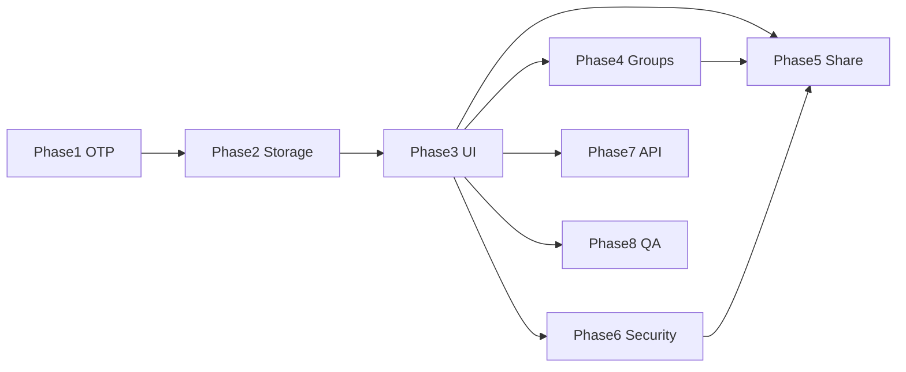

# 實作任務 — MustAuth Flutter 移植

> 建議實作順序；每項完成後以 `requirements.md` 驗收標準自測。`- [ ]` 供 Flutter 專案勾選。

---

## Phase 0：專案骨架

- [ ] **T0.1** 建立 Flutter 專案結構：`lib/domain`, `lib/data`, `lib/presentation`, `test/`
- [ ] **T0.2** 設定環境變數：`API_BASE_URL`, `WEB_BASE_URL`（對應 Android `BuildConfig`）
- [ ] **T0.3** 註冊 `otpauth` / `mustauth` deep link（iOS Universal Links + Android intent-filter）

---

## Phase 1：核心 OTP（無 UI 依賴）

- [ ] **T1.1** 實作 `TokenCalculator` 對等邏輯（HOTP/TOTP/Steam + SHA1/256/512）
- [ ] **T1.2** 單元測試：RFC 6238 向量 + Steam 字元集
- [ ] **T1.3** 實作 `OtpUriParser`（完整複製 `Entry(String)` 規則，含 label `:` 規則）
- [ ] **T1.4** 單元測試：Android 註解中的 MustAuth wiki 案例與 `SimpleScannerActivity` 註解範例 URI
- [ ] **T1.5** 實作 `OtpAccount.fromJson` / `toJson`（欄位名與 Android 一致）

---

## Phase 2：本機儲存

- [ ] **T2.1** `EncryptedAccountStore`：AES-GCM 檔案格式（IV 12 bytes 前綴）
- [ ] **T2.2** 平台金鑰：Android Keystore / iOS Keychain 包裝 AES key（或 V1 僅密碼模式 + 匯入匯出）
- [ ] **T2.3** CRUD：`loadAll`, `saveAll`, `add`, `update`, `delete`, `wipe`
- [ ] **T2.4** `last_used` 指派：新建 `DateTime.now().microsecondsSinceEpoch` 或 `nanoTime` 等效
- [ ] **T2.5** 備份：明文 JSON 陣列 + PBKDF2 `.aes` 格式讀寫

---

## Phase 3：主流程 UI

- [ ] **T3.1** 帳戶列表：OTP 顯示、TOTP 倒數、複製、置頂、排序
- [ ] **T3.2** 手動新增/編輯頁（對應 `EnterKeyActivity`）
- [ ] **T3.3** QR 掃描新增（對應 `SimpleScannerActivity`）
- [ ] **T3.4** 相簿 QR 辨識（對應 `LoadingPictureActivity`）
- [ ] **T3.5** Deep link 處理：`action=set` / `get`
- [ ] **T3.6** 重複帳戶對話框與覆蓋邏輯

---

## Phase 4：分組

- [ ] **T4.1** `GroupRepository` + `grouplistjson` 持久化
- [ ] **T4.2** 分組 CRUD、釘選、拖曳排序
- [ ] **T4.3** 主列表分組篩選
- [ ] **T4.4** 上限 10 組驗證與匯入截斷提示

---

## Phase 5：分享 / 批次 QR

- [ ] **T5.1** 帳戶多選 UI
- [ ] **T5.2** `genQRCodeStr` 對等：8 筆分割、`mulitpleURL` 組裝、account 冒號規則
- [ ] **T5.3** QR 顯示頁（可輪播多張 QR）
- [ ] **T5.4** 批次匯入解析 `mulitpleURL`
- [ ] **T5.5** `shareaccountlistjson` 歷史紀錄
- [ ] **T5.6** 分享前安全驗證閘道

---

## Phase 6：安全

- [ ] **T6.1** `local_auth` 指紋/臉部 + `isSecurityValidation` 開關
- [ ] **T6.2** 背景 5 分鐘鎖定 + App 生命週期 `enterBackgroundTime`
- [ ] **T6.3** 九宮格手勢（最少 4 點）設定與驗證
- [ ] **T6.4** 背景模糊遮罩（可選 `BackdropFilter`）
- [ ] **T6.5** Panic：平台特定廣播/快捷方式整合（或文件化替代方案）
- [ ] **T6.6** 螢幕截圖防護：`FLAG_SECURE` 等效

---

## Phase 7：API 與周邊

- [ ] **T7.1** `POST /version` 客戶端 + 動態 domain 更新
- [ ] **T7.2** 版本更新對話框 + 外部瀏覽器開啟 `version_info.url`
- [ ] **T7.3** WebView 說明/隱私頁
- [ ] **T7.4** 設定頁：主題、語系、排序、備份路徑（精簡 andOTP 遺留項）

---

## Phase 8：品質與交付

- [ ] **T8.1** 整合測試：新增 → 重啟 → OTP 一致
- [ ] **T8.2** 與 Android 交叉測試：匯出 QR → Android 掃描匯入（及反向）
- [ ] **T8.3** 效能：100 帳戶列表滾動
- [ ] **T8.4** 安全審查：secret 不落 log、記憶體清除策略
- [ ] **T8.5** 撰寫 Flutter 專案 README：引用本 spec 路徑與互通限制

---

## 依賴關係

---

## 完成定義（Definition of Done）

1. `requirements.md` 中 FR-01～FR-08 對應功能可演示。
2. `design.md` 第 3、4、5 節演算法與 URI 單元測試全過。
3. 與 Android 1.3.0 互換至少一組批次 QR（≤8 帳戶）成功。
4. 已知限制（Keystore 互通、手勢舊金鑰）已寫入 Flutter README。
